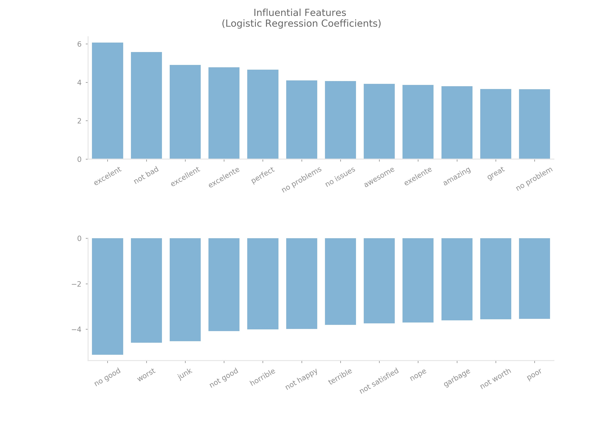

<br>

**[See notebook in Jupyter nbviewer](https://nbviewer.jupyter.org/github/reyvaz/SMS-Classification/blob/master/sms_spam.ipynb)**

# Sentiment Analysis on Mobile Phone User Reviews
***Author: Reynaldo Vazquez***  
***November 17, 2017***

## Tests different algorithms for sentiment classification of user reviews


Different specifications of Naïve-Bayes and Logistic-Regression with varying parameters and model complexity are tested in order to classify user reviews as positive or negative. 

The dataset used contains over 400 thousand reviews of mobile phones sold on Amazon extracted by [PromptCloud](https://www.promptcloud.com/). It was downloaded from [Kaggle](https://www.kaggle.com/PromptCloudHQ/amazon-reviews-unlocked-mobile-phones) on November 16, 2017. From this dataset, only the columns `Rating` and `Review` were used for the analysis. 

Original ratings consist of a scale from 1 to 5, with 5 as the most favorable rating. Ratings of 4 and 5 were assumed to be positive, 1 and 2 negative, and 3 neutral. Reviews deemed neutral were discarded. With this scheme, ~3/4 of the reviews in the original dataset were labeled as positive and ~1/4 as negative. 

Generally, the nature of this problem should not allocate more importance to misclassification of negative reviews as positive or vice-versa. Although, the dataset is somewhat unbalanced, both classes are well represented proportionally. With this in mind, main emphasis is placed on maximizing the area under the ROC curve and accuracy. However recall and precision are also individually considered.

The best performing algorithm is a Logistic Regression with regularization parameter C = 10 on words and bigrams with document frequencies of at least 2 in the training dataset. Its performance metrics are as follow,

```
                                      Param  Accuracy    Recall  Precision   ROC AUC
LogisticRegression (ngrams)          C = 10  0.979352  0.988174   0.984161  0.970901
```

#### Contents 
* [sentiment.ipynb](sentiment.ipynb) Jupyter Notebook containing classification algorithms in Python 
* [amazon-reviews-unlocked-mobile-phones.zip](amazon-reviews-unlocked-mobile-phones.zip) `zip` file containing the `csv` dataset
* [README.md](README.md) this file

<br>
<p align="center">
<a href="https://reyvaz.github.io/Sentiment-Analysis-Mobile/" 
rel="see html report">
</a>
</p>
<br>
<hr>
<br>
