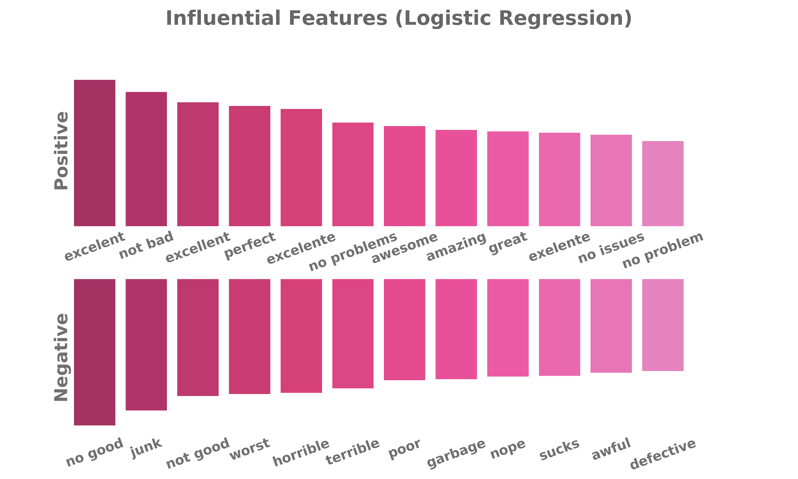

<br>

# Sentiment Classification

[**CLICK HERE**](https://nbviewer.jupyter.org/github/reyvaz/Sentiment-Analysis-Mobile/blob/master/sentiment.ipynb) to see the notebook in Jupyter nbviewer

## Sentiment Classification on Mobile Phone User Reviews

Different specifications of Multinomial Naïve-Bayes, Logistic-Regression, and Support Vector Machine, with varying features complexities were tested in order to classify user reviews as positive or negative. This notebook reports on the best performing model tested, which is a Logistic Regression on words, bigrams, and trigrams. The model achieves 99% precision and recall, 98% accuracy, and 97% ROC AUC. 

The dataset used contains over 400,000 reviews of mobile phones sold on Amazon extracted by [PromptCloud](https://www.promptcloud.com/). It was downloaded from [Kaggle](https://www.kaggle.com/PromptCloudHQ/amazon-reviews-unlocked-mobile-phones) on November 16, 2017. From this dataset, only the columns `Rating` and `Review` were used. 

The dataset does not contain actual positive or negative labels, sentiments were implied from ratings left by the reviewing customers. The original ratings consist of a scale from 1 to 5, with 5 as the most favorable rating. Ratings of 4 and 5 were assumed to be positive, 1 and 2 negative, and 3 neutral. Reviews deemed neutral were discarded. With this scheme, ~3/4 of the reviews in the original dataset were labeled as positive and ~1/4 as negative. 

#### Model Performance Metrics
```
Model: Logistic Regression 
Train Accuracy = 1.00
Test Accuracy  = 0.98
Recall  = 0.99
Precision  = 0.99
ROC AUC  = 0.97
```

#### Contents 
* [sentiment.ipynb](sentiment.ipynb): Jupyter Notebook containing the best performing classification model tested. 
* [sentiment_old.ipynb](sentiment_old.ipynb): An older version of the Jupyter Notebook (contains other tested models).
* [sentiment_utils.py](sentiment_utils.py): Python scrypt containing some auxiliary functions.
* [cm_heat_plots.py](cm_heat_plots.py):  Python scrypt containing functions to create confusion matrix plots.
* [media](media): Output and auxiliary images.
* [README.md](README.md): this file.

<br>
<p align="center">
<a href="https://reyvaz.github.io/Sentiment-Analysis-Mobile/" 
rel="see html report">
</a>
</p>
<br>

[**GitHub Pages**](https://reyvaz.github.io/Sentiment-Analysis-Mobile/)

<hr>
<br>
